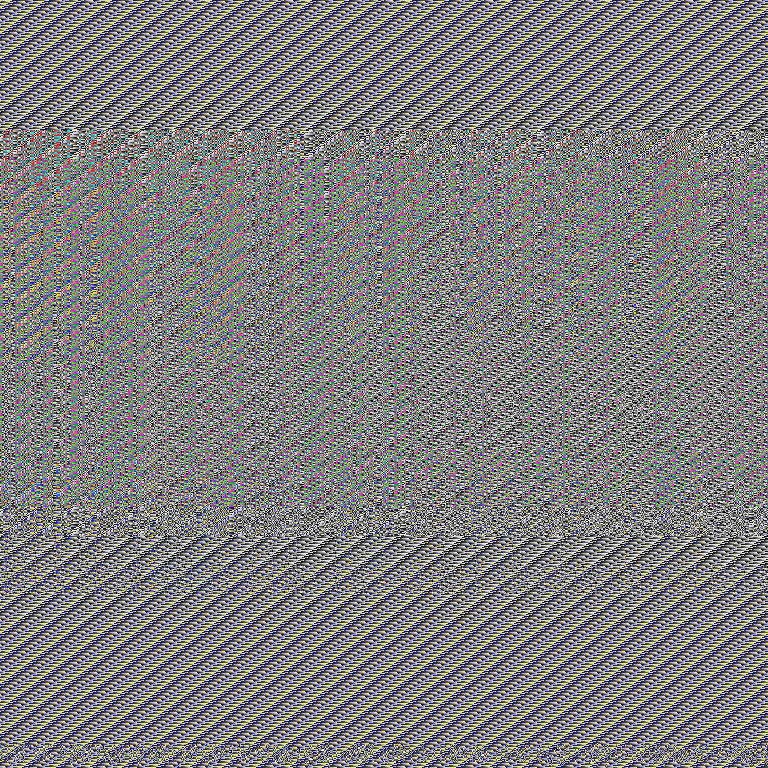

# Meow

### category: Reversing

[한국어 버전](Meow.ko.md)

## Problem

`Meow.n` and `flag_enc.png` were given.




## Solve


`Meow.n` file is a [Neko VM](https://nekovm.org) bytecode file that compiled by [Haxe](https://haxe.org/).

If we run this file with `neko Meow.n` command, we can see this output: 
`Usage: meow INPUT OUTPUT`.


I found out that with the command `nekoc -d Meow.n`, we can get human-readable version of the bytecode ([Meow.dump](Meow.dump)).


```
  global 97 : function 1997 nargs 2
  global 98 : function 2047 nargs 1
  global 99 : var 
  global 100 : string "Usage: meow INPUT OUTPUT" <<<
  global 101 : var 
  global 102 : float 3.94381953783290329
  global 103 : function 2111 nargs 2
  global 104 : var 
  global 105 : function 2136 nargs 0
```

In the global section, we can find the string `"Usage: meow INPUT OUTPUT"` that is shown when we run `Meow.n`

```
000C8A   2145    AccGlobal 100
000C8C   2146    Push
000C8D   2147    AccGlobal 37
000C8F   2148    Push
000C90   2149    AccField new
000C92   2150    ObjCall 1
000C94   2151    Push
000C95   2152    AccGlobal 99
000C97   2153    Push
000C98   2154    AccField println
000C9A   2155    ObjCall 1
```

In the code number 2145, the string is printed by println function. So we can think that this part of code is the 'main' function of the code.

```
000C7B   2136    AccGlobal 99
000C7D   2137    Push
000C7E   2138    AccField args
000C80   2139    ObjCall 0
000C82   2140    AccField length
000C84   2141    Push
000C85   2142    AccInt 2
000C87   2143    Lt
000C88   2144    JumpIfNot 2162 
```
Actually, this part above is the start point of the 'main' function.

***

I read the bytecode of the 'main' function step-by-step, and converted that into a pseudocode. 

```
function func(a, b) {
    if a.val < b.val {
        return -1;
    }
    else if a.val > b.val {
        return 1;
    }
    else {
        return 0;
    }
}


if args().length < 2 {
   println(new string("Usage: meow INPUT OUTPUT"))
   exit(1)
}

img = readPixels(args()[0])

if img.width != 768 or img.height != 768 {
   exit(1)
}

rnd = new Random()


i = 0
k = 0

while (i < arr.length) {
   
   z = k+arr[i]
   y = ((z << 9) + z)

   k = (y >> 5) ^ y

   i += 1
}

k = (k << 4) + k
k = (k << 10) ^ k
k = (k << 14) + k

rnd.setSeed(k)

rndval = (rnd.float() + 1) * rnd.float()


o = new array()
o101 = new(obj101)
o101.val = ranval
o101.index = 0
o.push(o101)


i = 1
while (i < 768) {
   a = new(obj101)
   t = o[i-1] * 3.94381953783290329   
   a.val = (1 - o[i-1].val) * t
   a.index = i
   o.push(a)
   i+=1
}

o.sort(func)

k = 0
while (i < img.height) {
   
   while (j < img.width) {

      pos = o[k].index % img.width
      px1 = img.get_pixel(pos, i)
      px2 = img.get_pixel(j, i)
      img.set_pixel(pos, i, px2)
      img.set_pixel(j, i, px1)
      
      k = (k+1)%768

      j+=1
   }

   i+=1
}


k = 0
while (i < img.height) {
   while (j < img.width) {
      t = o[k].val
      vv = int(t*13337)
      px3 = img.get_pixel(j, img.height)
      b1 = ((vv & 255) << 8) | (vv & 255)
      b2 = (((vv & 255) << 16) | b1) ^ px3
      img.set_pixel(j, i, b2)
      k = (k+1)%100 
      j+=1
   }
   i+=1
}

writePixels(args()[1], img)
```


Thanks to Neko VM's github repository, I could find out what these bytecode commands are doing.
* https://github.com/HaxeFoundation/neko/blob/master/vm/interp.c#L613


According to this pseudocode, it create array 'o' filled with random values, and use it for encoding image. But we can see the seed of the random object is never changing. Therefore random values in array 'o' is not actually random. I wrote [Data.hx](Data.hx) file and compiled to Neko bytecode file. By executing this file, I was able to obtain the array.

***

Image encoding logic can be divided into two steps.

```
k = 0
while (i < img.height) {
   
   while (j < img.width) {

      pos = o[k].index % img.width
      px1 = img.get_pixel(pos, i)
      px2 = img.get_pixel(j, i)
      img.set_pixel(pos, i, px2)
      img.set_pixel(j, i, px1)
      
      k = (k+1)%768

      j+=1
   }

   i+=1
}
```

The first step swaps two pixels for all pixels in the image.

```
k = 0
while (i < img.height) {
   while (j < img.width) {
      t = o[k].val
      vv = int(t*13337)
      px3 = img.get_pixel(j, img.height)
      b1 = ((vv & 255) << 8) | (vv & 255)
      b2 = (((vv & 255) << 16) | b1) ^ px3
      img.set_pixel(j, i, b2)
      k = (k+1)%100 
      j+=1
   }
   i+=1
}
```

The second step performs `pixel xor vv` operation for all pixels in the image.

Finally, I wrote a decoder that reverses all these encoding process.

[go.py](go.py)
```
import sys
from PIL import Image

def pixel2hex(px):
    return int('{:02x}{:02x}{:02x}'.format(px[0], px[1], px[2]), 16)

def hex2pixel(hx):
    return (hx >> 16, (hx & 0xff00) >> 8,hx & 0xff, 255)

class KV():
    def __init__(self, idx, val):
        self.index = idx
        self.val = val

    def __repr__(self):
        return "%d => %f" % (self.index, self.val)
    
ori = [ ... ]
o = [KV(k,v) for k, v in ori.items()]
vt = [ ... ]


frompath = "input.png"
topath = "output.png"
imgsize = 768

img = Image.open(frompath)
pixels = img.load()

def enc():
    k = 0
    for i in range(imgsize):
        for j in range(imgsize):
            pos = o[k].index % imgsize
            px1 = pixels[pos, i]
            px2 = pixels[j, i]
            pixels[pos, i] = px2
            pixels[j, i] = px1
            assert(k == j)
            k = (k+1)%768
    
    k = 0
    for i in range(imgsize):
        for j in range(imgsize):
            
            t = o[k].val
            vv = int(t*13337)


            px3 = pixel2hex(pixels[j, i])
            b1 = ((vv & 255) << 8) | (vv & 255)
            b2 = (((vv & 255) << 16) | b1) ^ px3
            pixels[j,i] = hex2pixel(b2)
            k = (k+1)%100

    img.save(topath)
    print("SAVED " + topath)


def dec():
    for vv, i, j in vt:
        px = pixel2hex(pixels[j,i])
        key = ((vv & 255) << 8) | (vv & 255) | ((vv & 255) << 16)
        pixels[j,i] = hex2pixel(px ^ key)


    for i in reversed(range(imgsize)):
        for j in reversed(range(imgsize)):

            pos = o[j].index % imgsize
            px1 = pixels[j, i]
            px2 = pixels[pos, i]
            pixels[j, i] = px2
            pixels[pos, i] = px1


    
    
    img.save(topath)
    print("SAVED " + topath)
        

dec()
```


## Flag
TWCTF{Ny4nNyanNy4n_M30wMe0wMeow}


